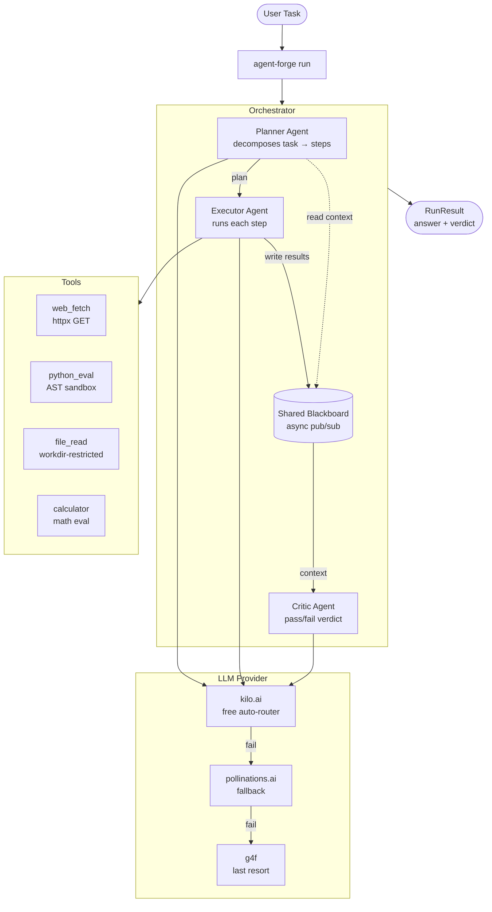

# Agent Forge

> Multi-agent LLM orchestration for Python — a Planner → Executor → Critic pipeline with tool-calling, an eval harness, structured observability, and a **keyless** LLM backend (no API key required).

[](LICENSE)
[](https://github.com/chirag127/agent-forge/stargazers)
[](https://github.com/chirag127/agent-forge/commits)
[](https://python.org)

## What it is / why it exists

Wiring up a multi-agent LLM system usually means an API key, a vendor SDK, and boilerplate to route tasks between agents. **Agent Forge** collapses that into one dependency: a task goes in, a **Planner** decomposes it, an **Executor** runs each step (calling tools where needed), and a **Critic** judges the result. It ships with an LLM-as-judge eval harness, OpenTelemetry spans, and a keyless provider chain — so you can build and benchmark agents with `pip install` and zero credentials.

- **Repo**: <https://github.com/chirag127/agent-forge>
- **Landing (GH Pages)**: <https://chirag127.github.io/agent-forge/>
- **PyPI**: planned (`agent-forge`) — install from source today.

⭐ If this is useful, please **star the repo** — it helps others find it.

## Architecture



## How it works

- **Planner** — queries the LLM and decomposes the task into ordered steps; each step is either a tool call (JSON name + args) or a pure reasoning step. Output is parsed JSON.
- **Executor** — runs each step in sequence. Tool args are validated against the tool's JSON Schema, the function is called, and the LLM synthesizes the raw output into a finding. Context threads forward.
- **Critic** — reviews the full step log and returns a `pass`/`fail` verdict with reason + confidence (LLM-as-judge).
- **Blackboard** — an async-safe shared key-value store with pub/sub; the communication layer for multi-agent runs.

## Features

- **Planner / Executor / Critic** pipeline out of the box
- **Pluggable tools** via a `@tool` decorator with JSON Schema validation
- **Keyless LLM** — kilo.ai → pollinations.ai → g4f failover, no credentials
- **Eval harness** — gold dataset with typed assertions incl. `llm_judge`
- **Observability** — structlog structured logs + OpenTelemetry spans
- **Async-safe blackboard** for multi-agent collaboration
- **CLI + library** — use `agent-forge run` or import the `Orchestrator`

## Tech stack

- **Python 3.13**
- **Typer** + **Rich** (CLI)
- **httpx** (async HTTP / tools)
- **jsonschema** (tool arg validation) · **pydantic** (models)
- **structlog** + **OpenTelemetry SDK/API** (observability)
- **g4f** (keyless provider, last-resort) · **anyio** (async)
- **pytest** / **pytest-asyncio** / **pytest-cov** / **respx** (tests)

## Repo structure

```text
agent-forge/
├── agent_forge/
│   ├── agents/            # Orchestrator: Planner, Executor, Critic
│   ├── tools/             # @tool registry + calculator, python_eval, web_fetch, file_read
│   ├── providers/         # keyless LLM chain (kilo → pollinations → g4f)
│   ├── observability/     # structlog + OpenTelemetry configure()
│   ├── blackboard.py      # async shared KV store + pub/sub
│   └── cli.py             # Typer app: run / eval
├── evals/
│   ├── gold_dataset.json  # benchmark tasks with typed assertions
│   └── run_eval.py        # scores pass/fail → report.md
├── tests/                 # unit + integration + live-network
└── pyproject.toml
```

## Quick start

Requires Python `>=3.13`.

```bash
# Install from source
git clone https://github.com/chirag127/agent-forge
cd agent-forge
python -m venv .venv && source .venv/bin/activate   # .venv\Scripts\activate on Windows
pip install -e .

# Run a task
agent-forge run "What is the square root of 2025?"

# Verbose logs + OpenTelemetry spans
agent-forge run "Compound interest: 10000 at 8% for 5 years" --verbose --otel

# Run the eval harness over the gold dataset
agent-forge eval
```

> Once published to PyPI, `pip install agent-forge` will work directly.

## CLI reference

| Command | What it does | Key options |
|---|---|---|
| `agent-forge run "<task>"` | Run a task through Planner → Executor → Critic; prints steps table + final answer + critic verdict | `--verbose/-v`, `--otel`, `--timeout/-t <sec>` |
| `agent-forge eval` | Run the eval harness over the gold dataset; writes a report | `--dataset/-d <path>`, `--report/-o <path>`, `--verbose/-v`, `--timeout/-t` |

### Library usage

```python
from agent_forge.agents import Orchestrator
from agent_forge.blackboard import Blackboard

bb = Blackboard()
orch = Orchestrator(blackboard=bb)
result = orch.run("Summarize and evaluate: the Fibonacci sequence")

print(result.final_answer, result.passed)
print(bb.snapshot())   # inspect shared state
```

### Registering a tool

```python
from agent_forge.tools import tool

@tool(
    name="my_tool",
    description="Does something useful.",
    parameters={
        "type": "object",
        "properties": {"query": {"type": "string"}},
        "required": ["query"],
    },
)
def my_tool(query: str) -> str:
    return f"Result for: {query}"
```

### Built-in tools

| Tool | What it does |
|---|---|
| `calculator` | Evaluates math expressions (`sqrt`, `**`, trig) |
| `python_eval` | Runs sandboxed Python — no imports, no dunder access |
| `web_fetch` | HTTP GET via httpx, strips HTML, truncates at 4000 chars |
| `file_read` | Reads files restricted to a working directory |

## Observability

```python
from agent_forge.observability import configure
configure(level="DEBUG", otel=True, json_logs=True)
```

Every agent step, tool call, token count, and latency is logged via **structlog**. **OpenTelemetry** spans (`planner.plan`, `executor.step`, `critic.verify`, `orchestrator.run`) go to a console exporter by default — point `OTEL_EXPORTER_OTLP_ENDPOINT` at any OTLP backend (Jaeger, Honeycomb, …) without code changes.

## Tests

```bash
pip install -e ".[dev]"
pytest tests/unit/ tests/integration/ -v   # no network
pytest tests/test_llm_live.py -v -s         # live LLM
pytest                                      # full suite, coverage-gated at 80%
```

## Cost

**$0.** The keyless provider chain (kilo.ai → pollinations.ai → g4f) needs no API key and no card. Self-host anywhere Python runs.

## Part of the oriz family

One of ~80 projects in the **oriz** family. See the blog at <https://blog.oriz.in>.

## Contributing

Issues and PRs welcome. Conventional commits, `main` only. Keep `pytest` green (80% coverage gate).

## License

MIT © Chirag Singhal — see [LICENSE](LICENSE).

## Author

Chirag Singhal · <chirag@oriz.in>

## Status

**Beta** (v0.1.0) — core pipeline, tools, evals, and observability are working and tested. PyPI publish and additional built-in tools are on the roadmap.

_Conventional commits are the changelog._
